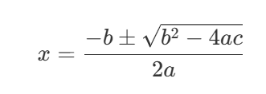
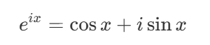
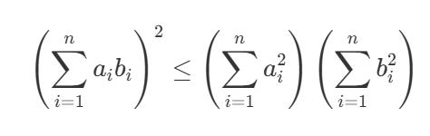
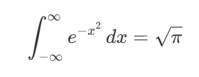

word outside of \$\$ symbols.(Segoe UI)

$words \ inside \ of \ \$\$\  symbols$
$fancy\ words\ in\ money\ symbol$
(Computer Modern)

$\text{text inside money symbols}$
## 行內數學（Inline Math）
這是一個行內數學公式： $E=mc^2$，愛因斯坦的質能方程式。
請注意，行內數學公式必須包在單一對 `$` 符號中，且不能有空格在 `$` 符號內側。
$E = mc^2, CO_2$

## 區塊數學（Block Math）
這是一個區塊數學公式：
$$\int_a^b f(x) \, dx = F(b) - F(a)       $$
請注意，區塊數學公式必須包在雙重對 `$$`
符號中，且不能有 space 在 `$$` 符號內側。

## 希臘字母列表
- $\alpha$ (alpha)
- $\beta$ (beta)  
- $\gamma$ (gamma)
- $\delta$ (delta)
- $\epsilon$ (epsilon)
- $\zeta$ (zeta)
- $\eta$ (eta)
- $\theta$ (theta)
- $\lambda$ (lambda)
- $\mu$ (mu)

......

## 題目練習
請將以下數學公式轉換成 Markdown 格式：
1.二次方程式公式：
- 國中生最常見的二次方程式解公式：
   
   <!--
   $$
   x = \frac{{-b \pm \sqrt{{b^2 - 4ac}}}}{{2a}}
   $$
   -->
2.畢氏定理：
- 直角三角形的兩直角邊長分別為 a、b，斜邊長為 c，則有：
   
   <!--
   $$
   a^2 + b^2 = c^2
   $$
   -->
3. 歐拉恆等式(一般型)：
- 定義虛數次方可以用此式定義
    
    <!--
    $$
    e^{ix} = \cos x + i \sin x
    $$
    -->
4. 柯西-施瓦茲不等式：
- 線性代數中的一個重要定理
   
   <!--
   $$
   \left( \sum_{i=1}^n a_i b_i \right)^2 \leq \left( \sum_{i=1}^n a_i^2 \right) \left( \sum_{i=1}^n b_i^2 \right)
   $$
   -->
5. 高斯積分：
- 著名的積分結果
   
   <!--
   $$
   \int_{-\infty}^{\infty} e^{-x^2} \, dx = \sqrt{\pi}
   $$
   -->
6. practice(taylor_series):
- 對函數做單點近似的方式
   $$
   f(x) = f(a) + f'(a)(x - a) + \frac{f''(a)}{2!}(x - a)^2 + \frac{f'''(a)}{3!}(x - a)^3 + \cdots
   $$
7. maxwell equations(integral form)
    $$
    \begin{aligned}
    &\oint_{\partial \Sigma} \mathbf{E} \cdot d\mathbf{l} = -\frac{d}{dt} \iint_{\Sigma} \mathbf{B} \cdot d\mathbf{A} \\
    &\oint_{\partial \Sigma} \mathbf{B} \cdot d\mathbf{l} = \mu_0 \iint_{\Sigma} \mathbf{J} \cdot d\mathbf{A} + \mu_0 \epsilon_0 \frac{d}{dt} \iint_{\Sigma} \mathbf{E} \cdot d\mathbf{A} \\
    &\iint_{\partial V} \mathbf{E} \cdot d\mathbf{A} = \frac{1}{\epsilon_0} \iiint_{V} \rho \, dV \\
    &\iint_{\partial V} \mathbf{B} \cdot d\mathbf{A} = 0
    \end{aligned}
    $$
8. maxwell equations(differential form)
    $$
    \begin{aligned}
    &\nabla \times \mathbf{E} = -\frac{\partial \mathbf{B}}{\partial t} \\
    &\nabla \times \mathbf{B} = \mu_0 \mathbf{J} + \mu_0 \epsilon_0 \frac{\partial \mathbf{E}}{\partial t} \\
    &\nabla \cdot \mathbf{E} = \frac{\rho}{\epsilon_0} \\
    &\nabla \cdot \mathbf{B} = 0
    \end{aligned}
    $$
